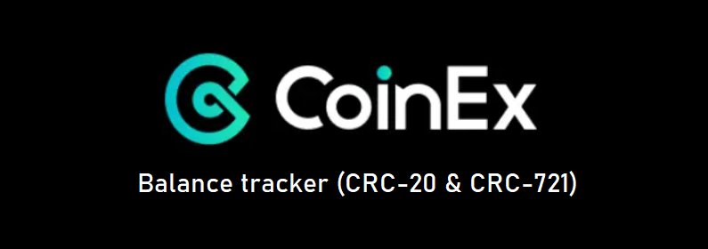
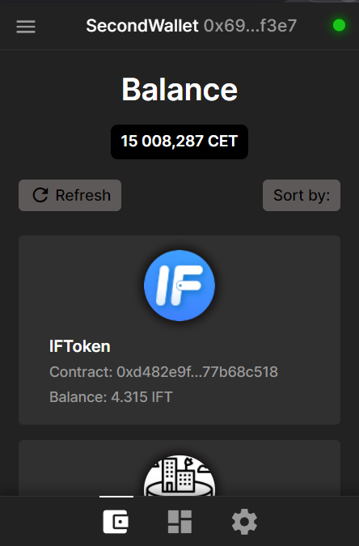
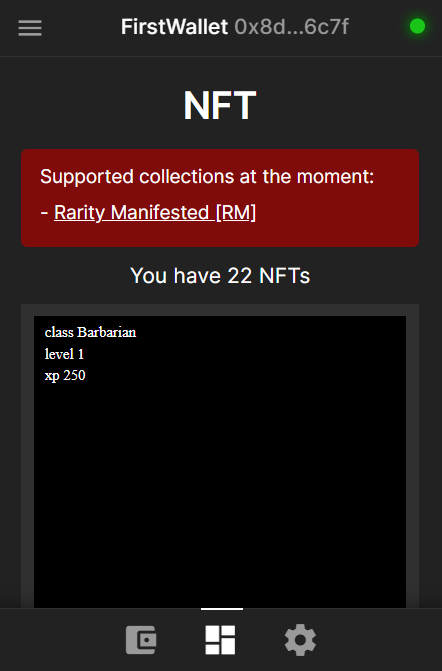
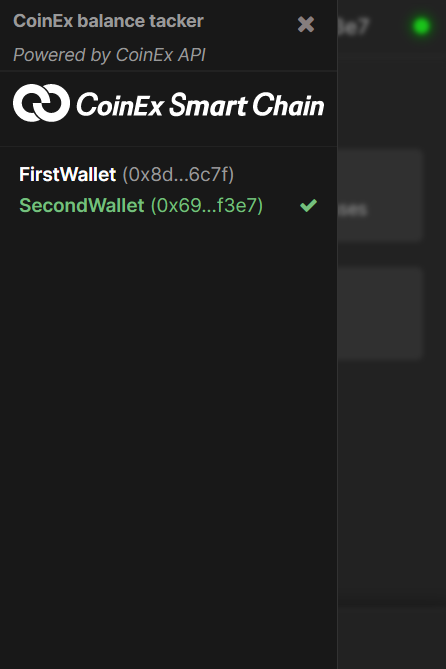

<div>
  <p align="center">
    
  <hr>
<h3 align="center"><u>CoinEx balance tacker</u></h3>
    <p align="center">A Chrome browser extension for tracking transfers and balances of assets on CoinEx Smart Chain (CSC)</p>
  <p align="center">
    <i>Powered by <b>CoinEx API</b></i>
  </p>
  <hr>
</div>


## Features:

- Ability to add new wallets to your address book and delete unnecessary ones;
- View your tokens balance and transfer history;
- View your NFTs

----------

## How to use / How to install extension:

1. Download this repository (ZIP)
2. Unzip it
3. Turn on **Developer mode** in the Chrome extension section and install extension:
    1. Go to ```chrome://extensions/``` and toggle the **Developer mode** in the top right.
    2. Click the **Load unpacked extension** button and select the unzipped folder of extension to install it.
4. **Attention ! -** API queries may return a CORS error. To solve this, you need to run a local proxy server on NodeJS. You can see how to do it here: [https://github.com/Rob--W/cors-anywhere](https://github.com/Rob--W/cors-anywhere). In my example, the server is running on port ```8080```. **Soon I will create a remote server and you no longer need to run any local servers**

----------

## Screens:

  <table>
  <tr>
    <td></td>
    <td></td>
    <td></td>
  </tr>
</table>

----------


